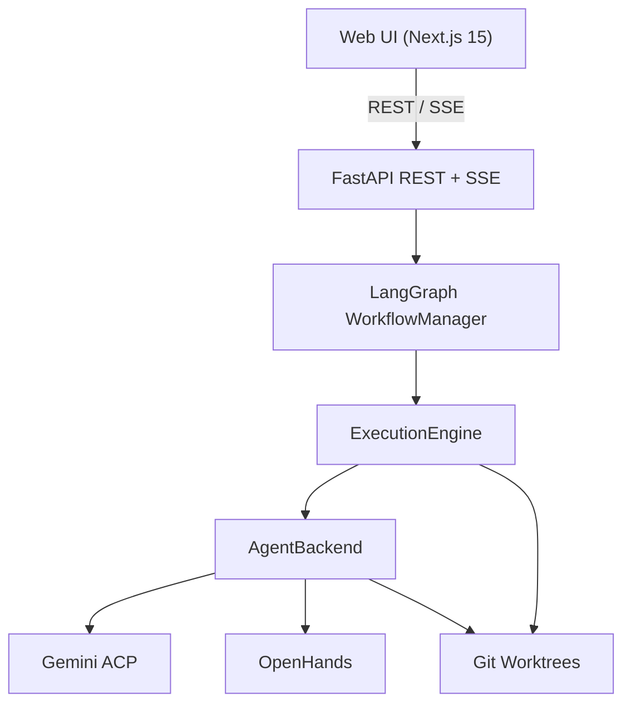
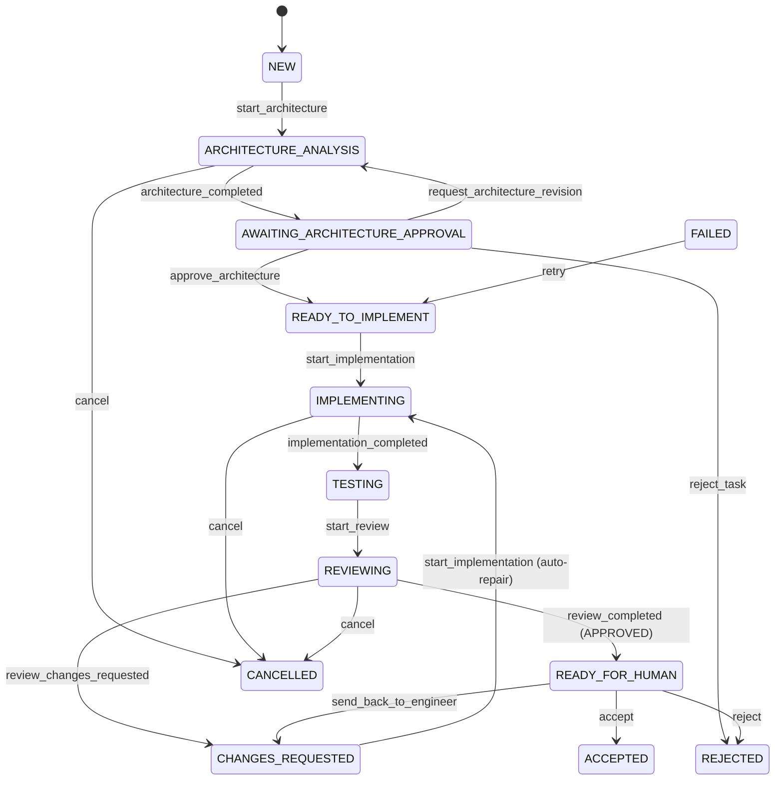
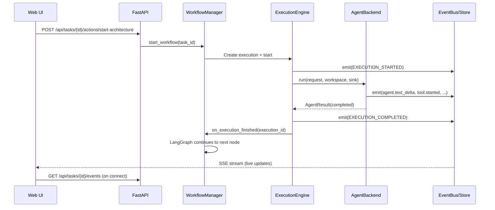

# SceneWorks Architecture

## Overview

SceneWorks is an AI-native software company control plane that orchestrates
virtual company roles through a LangGraph workflow to produce and review code
changes in isolated Git worktrees.



## Component responsibilities

### FastAPI application (`backend/app/main.py`)

- HTTP API server bound to `127.0.0.1:8010`
- Registers routers: projects, tasks, executions, events, company, settings,
  dashboard
- Serves SSE streams for live execution events
- CORS configured for Next.js dev server (`localhost:3000`)

### LangGraph WorkflowManager (`backend/app/workflows/manager.py`)

- LangGraph is the **sole orchestration mechanism** for task workflows
- Nodes are thin adapters that delegate real work to existing services
- Durable checkpointing via `langgraph-checkpoint-sqlite`
- Thread prefix: `task-<task_id>`, enabling checkpoint resume across restarts
- Key nodes: triage, architect, human_approval, engineer, testing, reviewer,
  complete

### ExecutionEngine (`backend/app/execution/engine.py`)

- Runs agent executions as asyncio tasks (non-blocking)
- Persists lifecycle events to SQLite via EventStore
- Supports cancellation with configurable grace period
- Recovers interrupted executions on startup
- Generic: does not know about tasks, roles, or prompts
- Calls `on_execution_finished` hook for workflow continuation

### AgentBackend protocol (`backend/app/agents/base.py`)

- Isolates execution providers behind a stable contract: `run()`, `cancel()`,
  `health()`
- The `AgentEventSink` abstraction channels per-execution events to
  SceneWorks event storage and SSE streaming
- `Workspace` and `AgentRequest` are backend-agnostic data types
- Backends must emit only the generic event vocabulary from
  `app/events/types.py`

### Gemini ACP backend (`backend/app/agents/gemini_acp.py`)

- Launches Gemini CLI in ACP mode (protocol v1 over stdio)
- Implements the client side of ACP: sends `initialize`, `session/new`,
  `session/prompt` requests
- Implements the server side of ACP (`AgentPolicy`): mediates every
  `fs/read_text_file`, `fs/write_text_file`, `terminal/create` request
  according to role permissions
- Enforces workspace boundaries (paths must resolve within worktree or repo)
- Maps ACP `session/update` notifications to SceneWorks event vocabulary

### OpenHands backend (`backend/app/agents/openhands.py`)

- Status **EXPERIMENTAL**, opt-in. `local` mode live-validated for read-only
  roles on openhands-sdk 1.17.0; see [backends.md](backends.md) and
  [wp2.5-openhands-validation.md](wp2.5-openhands-validation.md).
- Four modes resolved explicitly by `resolve_mode()` and emitted as a
  `backend.mode` event: `local` (in-process `LocalWorkspace`, no server),
  `remote` (Agent Server), `http` (REST polling), `cli` (subprocess). **No silent
  fallback** — a mode that cannot be used fails with the reason.
- The synchronous SDK runs in a worker thread; events reach SceneWorks through the
  SDK's `callbacks=` hook via a thread-safe queue, so output streams during a run
  and the API event loop is never blocked.
- Maps OpenHands events to the generic SceneWorks vocabulary; OpenHands payloads
  never leave this module. `test.result` and `git.commit` are deliberately not
  produced (no structured test signal; SceneWorks captures commits itself).
- Cancellation is `pause()` then `close()`, off-loop.
- **Passes the worktree as the working directory but does not enforce
  confinement**: there is no OS or container boundary. See
  [limitations.md](limitations.md) for the exact trust boundary.
- Configuration: `SCENEWORKS_OPENHANDS_MODEL` (required, litellm form),
  `SCENEWORKS_OPENHANDS_BASE_URL` (LLM endpoint),
  `SCENEWORKS_OPENHANDS_URL` (Agent Server — a *different* service),
  `SCENEWORKS_OPENHANDS_MODE`, `SCENEWORKS_OPENHANDS_MAX_ITERATIONS`,
  `SCENEWORKS_OPENHANDS_EXECUTABLE`

### Git worktree service (`backend/app/git/workspace.py`)

- Creates detached (read-only) and branch (writable) worktrees
- Resolves base commits, creates task branches (`sw-task-<id>`)
- Manages commits, diffs, and cleanup
- Ensures worktrees are created outside the human working tree
- Dirty human-tree files do not leak into worktrees

### Event system (`backend/app/events/`)

- `EventBus`: In-process publish/subscribe for SSE streaming
- `EventStore`: Durable SQLite-backed event persistence
- `types.py`: Structured event vocabulary with human-readable labels
- V2.2 events: workflow triage, role selection, repair started,
  repair limit reached

### Domain layer (`backend/app/domain/`)

- `task_states.py`: Explicit state machine with transition validation
- `permissions.py`: Role permissions (read, write, shell, git, network)

### Role system (`backend/app/roles/`)

- `definitions.py`: Role definitions as frozen dataclasses — key, permissions,
  backend, model profile, responsibilities
- `prompts.py` + `prompts/*.md`: Prompt building from editable markdown
  templates
- `registry.py`: Role lookup with backend resolution

### Project Memory (`backend/app/services/memory.py`, `memory_retrieval.py`)

- Persistent project memory backed by SQLite. No embeddings, no vector
  database, no knowledge graph.
- Types: initiative_summary, architecture_decision, product_decision,
  technology_decision, constraint
- Statuses: proposed, accepted, rejected, superseded, archived
- Provenance: source (authoring role), source_task_id, source_execution_id,
  supersedes_id, timestamps. Review decisions (`memory.accepted`,
  `memory.rejected`) are recorded as events with actor and previous status.
- **Retrieval is two-stage and deterministic**: a SQL prefilter narrows to
  memories matching at least one *term* (an OR over per-term LIKE), then
  `memory_retrieval.py` — pure functions, no database — scores and ranks them.
  Weighted signals over title, content and tags plus an exact-phrase bonus;
  stable tie-breaking on coverage, recency and id.
- **Every result explains itself**: `matched_terms`, `matched_tags`, `score`,
  `coverage` and per-signal contributions travel with each match, and land in
  the `memory.injected` event.
- Bounded context (5 items, 20 KB) injected into Triage and Architect nodes.
- **Only accepted memories are authoritative.** Proposals are returned under a
  separate key that the prompt builder cannot reach, and
  `propose_from_execution()` has no `status` parameter — there is no argument
  by which agent output becomes accepted project truth.
- V2.4 passed whole task descriptions into one SQL `ILIKE`, so realistic
  descriptions retrieved nothing. See [memory.md](memory.md) and
  [wp0-baseline-audit.md](wp0-baseline-audit.md) F4.
- Not captured yet: the commit a decision was made against (needs a schema
  column; deferred to WP3 for migrations, WP6 for Git provenance).

### Frontend (`web/`)

- Next.js 15 App Router, React 19, TypeScript
- Pages: Dashboard, Projects, Tasks (detail with live streaming),
  Executions, Company, Settings
- Components: ActionBar, DiffView, EventLog, Markdown, Sidebar, StatusBadge

## Dependency boundaries

```
Web UI (Next.js)
  │  depends on
  ▼
FastAPI REST + SSE
  │  depends on
  ▼
LangGraph WorkflowManager  ─── depends on ──► ExecutionEngine
  │  depends on                                  │  depends on
  ▼                                              ▼
Workflow/Task services           AgentBackend protocol
  │  depends on                    │  implements
  ▼                               ▼
Domain models (SQLAlchemy)    Gemini ACP / OpenHands / Fake
  │
  ▼
SQLite (state, events, checkpoints)

Agents, backends, worktree services, and event system
must NOT depend on LangGraph.
LangGraph is an orchestration dependency only.
```

## Task/initiative lifecycle



## Engineer ↔ Reviewer repair loop (V2.2+)

When the reviewer emits `VERDICT: CHANGES_REQUESTED`, the LangGraph graph
automatically routes back to the engineer node. The loop:

1. Reviewer inspects engineer's commit/diff/tests
2. If `CHANGES_REQUESTED`, graph routes to engineer
3. Engineer works in the **same worktree** (continuity), applies fixes
4. Cycle repeats until `APPROVED` or `max_review_iterations` exhausted
5. If limit reached, task stays in `CHANGES_REQUESTED` for human intervention

The `max_review_iterations` setting (default 3) is configurable via
`SCENEWORKS_MAX_REVIEW_ITERATIONS`.

## Advisory routing (V2.2+)

The triage node inspects each task and may suggest advisory input from
Product, CTO, or Technical Expert roles before implementation. This is
advisory only — tasks can still progress without advisory input unless
the role specifies `approval_authority`.

## Cancellation and recovery

- **Cancellation**: API call → engine signals `AgentEventSink.cancel()` →
  backend cancels process/session → engine finalizes as `CANCELLED`
- **Grace period**: `SCENEWORKS_CANCEL_GRACE_SECONDS` (default 15s) before
  forced task cancellation
- **Execution recovery**: On startup, all `QUEUED`/`STARTING`/`RUNNING`
  executions are marked `INTERRUPTED`. Tasks with actively running executions
  (`ARCHITECTURE_ANALYSIS`, `IMPLEMENTING`, `REVIEWING`) are marked `FAILED`.
  Tasks in human-waiting states (`AWAITING_ARCHITECTURE_APPROVAL`,
  `CHANGES_REQUESTED`) are preserved as-is.
- **Workflow recovery**: Checkpointed workflows in `READY_TO_IMPLEMENT` or
  `CHANGES_REQUESTED` are automatically resumed to the Engineer node on
  restart. Completed side effects (Git commits, terminal execution results)
  never replay — the idempotency check in the Engineer node prevents
  duplicate execution.
- **LangGraph checkpoints**: Workflow state is durably checkpointed in
  SQLite after each graph node. Thread key is `task-<task_id>`, enabling
  checkpoint lookup across restarts.
- **Cannot safely resume**: States where an agent execution was mid-flight
  (`ARCHITECTURE_ANALYSIS`, `IMPLEMENTING`, `REVIEWING`) are marked
  `FAILED` because the in-progress agent work is unrecoverable.
- **Human-waiting states**: `AWAITING_ARCHITECTURE_APPROVAL` (paused at
  LangGraph `interrupt()`) is preserved. The human must re-approve,
  reject, or request revision through the UI.

## Persistence

| Store | Backend | Content |
|---|---|---|
| SQLite (sceneworks.db) | SQLAlchemy 2 + aiosqlite | Projects, tasks, executions, events, artifacts |
| SQLite (workflow_checkpoints.db) | langgraph-checkpoint-sqlite | LangGraph state checkpoints |
| Filesystem | worktree_root | Isolated Git worktrees |

## Event flow



## Permissions

| Permission | Architect | Engineer | Reviewer | CTO/CEO/Product/GTM |
|---|---|---|---|---|
| `repository_read` | yes | yes | yes | yes |
| `repository_write` | **no** | yes | **no** | **no** |
| `shell_execute` | **no** | yes | yes | **no** |
| `git_commit` | **no** | yes | **no** | **no** |
| `network_access` | yes | **no** | **no** | yes |

Permissions are enforced by the backend adapter:
- **Gemini ACP**: The `AgentPolicy` rejects unauthorized `fs/write_text_file`
  and `terminal/create` requests from the agent
- **OpenHands**: Workspace confinement and configuration determine access
- **Prompt-level**: Role prompts instruct the agent of its limitations

## Repository / worktree model

```
~/projects/my-app/              ← human working tree (never touched)
    .git/
    src/
    README.md

~/sceneworks-worktrees/         ← SCENEWORKS_WORKTREE_ROOT
    my-app/                     ← bare repo clone
    my-app-sw-task-42/          ← engineer worktree (branch sw-task-42)
        src/
        README.md
        new-feature.py          ← agent changes here
    my-app-detached-7/          ← architect worktree (detached HEAD)
```

- Triage, Architect and the advisory roles get a **detached HEAD** worktree
  (no branch, no commits)
- Engineer gets a **branch worktree** (`sw-task-<id>`) with full write access
- Reviewer gets a **disposable worktree** for inspection
- Manual company asks that name a project get a **detached snapshot
  worktree** (`<repo>-sw-ask-<label>`), removed when the ask finishes
- Worktrees are cleaned up on task completion
- The human tree never contains agent changes

### The repository snapshot invariant

**No agent ever reads the human working tree.** Every execution — workflow
role *and* manual company ask — runs with its `cwd` set to a worktree pinned
to a specific commit, and the ACP file-system proxy rejects any path outside
that worktree (`AgentPolicy` / `_within_workspace`). The main checkout is not
an allowed read location, so uncommitted or staged edits in the human
checkout can never enter an answer.

The commit is pinned **once**, at the first node that touches the repository
(triage), and stored on `task.base_commit`. Architect, Engineer and Reviewer
all reuse it. This matters on the architecture-revision loop, where the
Architect node runs a second time: re-resolving the branch head there would
silently move the base between the analysis and the implementation.

Manual asks resolve the default branch head, record it as the execution's
`base_commit`, and prefix the stored decision artifact with the commit that
was analyzed, so a reader can tell which snapshot a conclusion applies to.

Consequence worth stating plainly: **a repository-grounded answer describes
committed state.** If the human has uncommitted work, the agent will not see
it, and will report on the repository as committed.

## Restart / cancellation behavior

- **Graceful shutdown**: `AppContext.shutdown()` cancels all active
  executions, marks them `INTERRUPTED`, and shuts down the workflow manager
- **Cancellation**: `ExecutionEngine.cancel()` signals the backend, then
  force-cancels the asyncio task after the grace period
- **Recovery on restart**: Interrupted executions are marked and corresponding
  running tasks fail. Workflows in safe-to-resume states (architecture approved,
  repair loop) are automatically resumed. Human-waiting states require
  human action. See `backend/app/execution/recovery.py` for the detailed
  state-by-state recovery contract.
