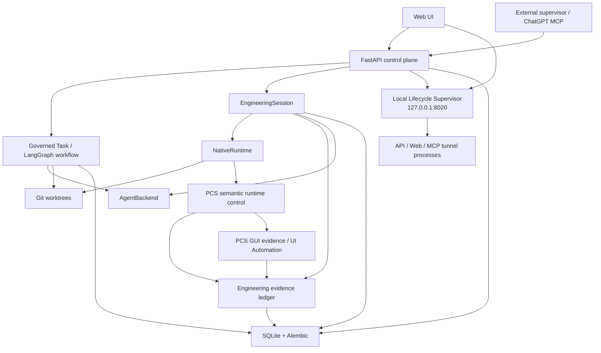

# SceneWorks Architecture

This document describes the current architecture after WP21. Historical WP documents remain useful implementation records, but they are not the canonical description of the running system.

## System model

SceneWorks is a local engineering control plane. It supports governed task workflows and direct engineering supervision while keeping model providers, autonomous workers, machine execution, infrastructure lifecycle, and evidence as separate concerns.



The web browser does not talk directly to the lifecycle supervisor. Diagnostics lifecycle requests pass through Next.js server-only routes so the bearer token never reaches browser JavaScript.

## Authority boundaries

### SceneWorks is the engineering authority

SceneWorks owns:

- task/session identity and lifecycle;
- worktree creation and scope;
- permission ceilings;
- Git/file/command/process observations;
- managed PCS process lifecycle;
- evidence correlation and persistence;
- final human decision boundaries.

An external agent may propose a diagnosis or claim that a fix works. That output is **inference**. SceneWorks-observed Git state, command results, process state, PCS observations, screenshots, and deterministic runbook results are **evidence**.

### Infrastructure lifecycle is supervisor-owned

WP21 introduces a separate standard-library Python supervisor bound only to `127.0.0.1:8020`. It owns lifecycle for three fixed infrastructure components: `api`, `web`, and `mcp_tunnel`.

The supervisor owns:

- process-ownership metadata and fingerprint checks;
- startup grace and health sampling;
- bounded automatic recovery and restart budgets;
- stop/start dependency ordering;
- durable operation acceptance/journaling before mutation.

FastAPI, provider agents, browser JavaScript, and the PowerShell launcher are clients, not lifecycle authorities. They may request semantic operations only. A port match alone is never authority to terminate a process; ambiguous ownership fails closed.

The MCP lifecycle surface is intentionally narrow:

```text
sceneworks.system.status
sceneworks.system.restart(component=api|web|mcp_tunnel|all)
```

It exposes no arbitrary PID, port, path, executable, URL, environment, command, or shell input.

### AgentBackend is optional autonomous labor

`AgentBackend` provides autonomous workers behind a common `run / cancel / health` contract. Current adapters are:

- `gemini_acp` — supported/default worker;
- `opencode` — non-ACP backup for write-capable coding/delegation;
- `openhands` — optional/experimental;
- `fake` — deterministic tests/qualification.

A backend is not the machine execution substrate. Direct MCP work remains available through `NativeRuntime` even when no autonomous backend can authenticate or run.

### ExecutionRuntime is model-free

`backend/app/runtime/native.py` owns direct workspace/command/process/Git primitives. It contains no prompt loop and no model reasoning.

```text
EngineeringSession
  -> workspace list/read/search/write
  -> command.run
  -> process start/output/stop
  -> git status/diff/commit
```

The runtime is worktree/session scoped, but arbitrary commands still execute with the OS authority of the user running SceneWorks. Repository confinement is not an OS sandbox.

Infrastructure lifecycle is separate from `ExecutionRuntime`: API/web/MCP-tunnel recovery goes through the WP21 supervisor rather than generic engineering process primitives.

## Governed task workflow

The normal task workflow remains LangGraph-based. It is one execution mode, not the only SceneWorks capability.

```text
NEW
 -> triage / optional advisors
 -> architecture analysis when required
 -> human architecture decision when required
 -> Engineer
 -> Reviewer
 -> READY_FOR_HUMAN
 -> ACCEPTED / REJECTED
```

Important properties:

- tasks use explicit states and legal transitions;
- `work_item_type` is `task | bug | feature | idea`;
- requested intent is `auto | change | investigate | plan | ask`;
- a task pins a base commit before repository-grounded work;
- Engineer work occurs on an isolated task branch/worktree;
- Reviewer uses a disposable read-only review worktree with shell validation capability;
- `CHANGES_REQUESTED` can route back to Engineer through a bounded repair loop;
- SceneWorks never auto-merges into the human branch.

## EngineeringSession and evidence

WP14 introduced provider-neutral direct engineering sessions. WP15 added durable turns/evidence.

An `EngineeringSession` binds project, optional governed task, runtime, base commit/worktree branch, requested permissions, and optional delegated backend/model defaults.

An `EngineeringTurn` is one explicit supervisor iteration. `EngineeringEvidence` records SceneWorks-captured actions with task/session/turn/action correlation.

Evidence categories include workspace, command/process, Git, PCS runtime/logs, verification, screenshot/visual evidence, and GUI observations/actions.

The evidence ledger does not duplicate full repository source/diffs. Large payloads are bounded and Git text is represented by hashes/metadata where appropriate.

WP21 infrastructure operations use a separate bounded SQLite operation journal because they must survive API restarts. Lifecycle journal entries are operational evidence but do not contain credentials, environment dictionaries, or arbitrary command strings.

## PCS runtime control

WP16 makes PCS lifecycle a SceneWorks-owned semantic capability rather than an agent-owned shell convention.

Project configuration defines named PCS run profiles, expected loopback health checks, log/crash paths, optional PCS semantic API endpoints, read-only external asset aliases, and deterministic verification runbooks.

SceneWorks can start/stop/restart PCS, persist logs, classify exit/crash/lost state, inspect health/runtime state, and run verification steps without asking a model to interpret whether the process is healthy.

External recordings are referenced by project aliases. Absolute host roots are not exposed through MCP results/evidence.

## GUI observation and automation

WP17 adds evidence-only GUI observation for the SceneWorks-managed PCS process: managed window/dialog discovery, screenshot capture, durable screenshot metadata/hash, and deterministic pixel comparison.

WP18 adds controlled Windows UI Automation: enumerate controls inside the managed PCS window, invoke/select/toggle/set-value on supported accessibility patterns, and capture before/after screenshot/visual evidence.

No arbitrary PID/HWND input, coordinate clicking, generic keyboard injection, or caller-provided PowerShell is exposed. GUI automation is a fallback when a semantic PCS API is unavailable.

## Web control surfaces

WP20 aligned the web application with the engineering-control architecture. WP21 extends Diagnostics with local infrastructure lifecycle state and semantic restart controls without making the browser a process authority.

- **Home** — create work and surface attention/active/recent items.
- **Work** — full governed task thread.
- **Issues** — filtered view over existing `bug | feature | idea` tasks; no separate issue database.
- **Projects** — repository registration lifecycle.
- **Control** — bounded read-only aggregate of active EngineeringSessions, managed PCS runs and recent evidence.
- **Settings** — backend/model/MCP configuration.
- **Diagnostics** — API/performance/connectivity diagnostics plus API/web/MCP-tunnel lifecycle status and semantic restart actions.

`GET /api/control-center` remains observational. WP21 lifecycle actions use dedicated Next.js server routes that proxy to the loopback supervisor and keep the supervisor token server-side.

## Model routing

Roles declare provider-neutral model intent such as `strongest`, `coding`, or `research`.

`ModelRouter` maps a profile to an optional backend/model. The resolved backend/model is persisted on each `Execution`, so later Settings changes cannot rewrite execution provenance.

Current role defaults are still code configuration in `backend/app/roles/definitions.py` (for example Engineer -> `coding`, Reviewer -> `strongest`). Settings can edit the profile-to-backend/model mapping, but **role-to-profile assignment is not yet editable in the UI**.

SceneWorks has an explicit no-silent-fallback policy for autonomous workers. If an agent mutates a worktree and then fails, SceneWorks preserves the worktree/diff; switching to another provider must be a deliberate decision.

## Verification model

SceneWorks already stores the ingredients for objective verification:

- task `acceptance_criteria` and `required_tests`;
- project engineering policy;
- Git provenance/changed files;
- workflow events/execution results;
- WP15 engineering evidence;
- WP16 deterministic PCS verification evidence;
- WP17/18 visual evidence;
- WP21 bounded infrastructure lifecycle state/operation history.

The missing layer is a first-class task-level synthesis that maps each criterion/test/policy rule to evidence and returns `PASS`, `FAIL`, or `UNVERIFIABLE`. Reviewer approval is not itself objective evidence.

See [verification-and-issue-traceability.md](verification-and-issue-traceability.md).

## Persistence

| Store | Content |
|---|---|
| `sceneworks.db` (SQLite/SQLAlchemy) | Projects, initiatives, work packages, tasks, executions, events, settings, memory, EngineeringSessions/Turns/Evidence, PCS control/runs |
| Alembic migrations | Versioned schema evolution in `backend/migrations/versions/` |
| workflow checkpoint SQLite | LangGraph durable workflow checkpoints |
| worktree filesystem | Isolated task/engineering worktrees |
| SceneWorks attachment/artifact storage | Task attachments and GUI screenshot evidence |
| supervisor local data | bearer token, bounded process-ownership metadata, lifecycle operation journal |

On Windows the supervisor data defaults to `%LOCALAPPDATA%\SceneWorks\supervisor\`.

## Security/trust boundary

FastAPI is a trusted local control plane and binds to loopback by default. There is currently no end-user authentication/RBAC.

The WP21 lifecycle supervisor is a separate local trust boundary: it also binds only to loopback, mutations require a per-user bearer token, and browser clients never receive that token. It is not a remote administration endpoint.

Worktree/path checks reduce accidental scope violations, but a process with shell execution has the privileges of the SceneWorks OS user. `network_access=false` is not a hard egress boundary without OS/container/firewall enforcement.

MCP remote access should therefore use a trusted authenticated tunnel/reverse proxy; the bare FastAPI service and the lifecycle supervisor must not be published directly.

## Dependency rule

The key architectural dependency direction is:

```text
Web / MCP
   -> FastAPI control plane
      -> task workflow OR EngineeringSession
         -> SceneWorks services/runtime/evidence
            -> Git / PCS / optional AgentBackend

Web server routes / FastAPI SupervisorClient / launcher
   -> local lifecycle supervisor
      -> owned API / web / MCP-tunnel process trees
```

Provider/protocol-specific objects belong inside adapters. Agent backends must not become the authority for Git, PCS state, verification truth, evidence persistence, or SceneWorks infrastructure lifecycle.
